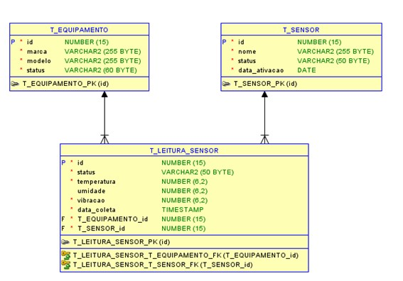

# FIAP - Faculdade de Informática e Administração Paulista

<p align="center">
<a href= "https://www.fiap.com.br/"></a>
</p>

<br>

# Enterprise Challenge - Sprint 3 - Reply

## Nome do grupo

Rumo ao NEXT!

## 👨‍🎓 Integrantes:

- Felipe Livino dos Santos (RM 563187)
- Daniel Veiga Rodrigues de Faria (RM 561410)
- Tomas Haru Sakugawa Becker (RM 564147)
- Daniel Tavares de Lima Freitas (RM 562625)
- Gabriel Konno Carrozza (RM 564468)

## 👩‍🏫 Professores:

### Tutor(a)

- Leonardo Ruiz Orabona

### Coordenador(a)

- ANDRÉ GODOI CHIOVATO


## 📜 Descrição

## 📜 Descrição

Este repositório corresponde à **Fase 5 do Challenge Reply (FIAP)**, realizada em parceria com a **Hermes Reply**, cujo foco é unir a **modelagem de banco de dados** a uma aplicação prática de **Machine Learning**. O trabalho parte da necessidade de estruturar dados de sensores em um banco relacional e, em seguida, aplicar algoritmos de aprendizado de máquina para identificar padrões e realizar previsões a partir dessas informações.

Dentro do repositório, na pasta `_notebooks`, encontra-se o **notebook principal do projeto**, que reúne todo o processo: análise exploratória dos dados, preparação do dataset, construção do modelo de Machine Learning, avaliação de desempenho e geração de gráficos para visualização dos resultados. Esse notebook concentra a documentação prática do trabalho, integrando código, explicações e evidências gráficas dos achados obtidos.

## Diagrama Entidade-Relacionamento (DER) - Descrição Detalhada



O modelo é composto por três entidades centrais que se relacionam para registrar as medições dos sensores de um equipamento específico.

---

## Entidade: T_EQUIPAMENTO

Esta tabela armazena o cadastro dos equipamentos que estão sendo monitorados.

**Propósito:** Manter um registro único para cada máquina ou ativo industrial, permitindo agrupar e analisar os dados por equipamento.

**Atributos:**

- `id` (NUMBER(15), Chave Primária - PK): Identificador numérico único para cada equipamento.  
- `marca` (VARCHAR2(255)): Marca do fabricante do equipamento (ex: "Siemens", "WEG").  
- `modelo` (VARCHAR2(255)): Modelo específico do equipamento.  
- `status` (VARCHAR2(60)): Estado operacional atual do equipamento (ex: "Ativo", "Em Manutenção", "Inativo").  

---

## Entidade: T_SENSOR

Esta tabela armazena o cadastro dos sensores utilizados no monitoramento.

**Propósito:** Manter um registro de cada sensor individualmente, já que um equipamento pode ter vários sensores e estes podem ser substituídos ao longo do tempo.

**Atributos:**

- `id` (NUMBER(15), Chave Primária - PK): Identificador numérico único para cada sensor.  
- `nome` (VARCHAR2(255)): Nome ou tipo do sensor (ex: "DHT22", "MPU6050").  
- `status` (VARCHAR2(50)): Estado operacional do sensor (ex: "Operacional", "Com Falha", "Desativado").  
- `data_ativacao` (DATE): Data em que o sensor foi instalado e começou a operar.  

---

## Entidade: T_LEITURA_SENSOR

Esta é a tabela principal (fato), que armazena os dados coletados ao longo do tempo.

**Propósito:** Registrar cada medição individual enviada pelo microcontrolador (ESP32), sendo a principal fonte de dados para análises e modelos de Machine Learning.

**Atributos:**

- `id` (NUMBER(15), Chave Primária - PK): Identificador único para cada registro de leitura.  
- `status` (VARCHAR2(50)): Status reportado no momento da coleta (ex: "Normal", "Alerta de Vibração").  
- `temperatura` (NUMBER(6,2)): Valor da temperatura aferido, com duas casas decimais.  
- `umidade` (NUMBER(6,2)): Valor da umidade aferido, com duas casas decimais.  
- `vibracao` (NUMBER(6,2)): Valor da vibração aferido, com duas casas decimais.  
- `data_coleta` (TIMESTAMP): Registro exato da data e hora da coleta.  
- `T_EQUIPAMENTO_id` (NUMBER(15), Chave Estrangeira - FK): Referência ao equipamento que gerou a leitura.  
- `T_SENSOR_id` (NUMBER(15), Chave Estrangeira - FK): Referência ao sensor que realizou a leitura.  

---

## Relacionamentos

- **T_EQUIPAMENTO e T_LEITURA_SENSOR:** Relacionamento de um-para-muitos (1:N). Um equipamento pode ter muitas leituras, mas cada leitura pertence a um único equipamento.  
- **T_SENSOR e T_LEITURA_SENSOR:** Relacionamento de um-para-muitos (1:N). Um sensor pode realizar muitas leituras, mas cada leitura é feita por um único sensor.  

---

## Script SQL de Criação das Tabelas (CREATE TABLE)

```sql
-- Tabela para armazenar os equipamentos monitorados
CREATE TABLE T_EQUIPAMENTO (
    id NUMBER(15) NOT NULL,
    marca VARCHAR2(255) NOT NULL,
    modelo VARCHAR2(255) NOT NULL,
    status VARCHAR2(60) NOT NULL,
    CONSTRAINT T_EQUIPAMENTO_PK PRIMARY KEY (id)
);

-- Tabela para armazenar os sensores individuais
CREATE TABLE T_SENSOR (
    id NUMBER(15) NOT NULL,
    nome VARCHAR2(255) NOT NULL,
    status VARCHAR2(50) NOT NULL,
    data_ativacao DATE,
    CONSTRAINT T_SENSOR_PK PRIMARY KEY (id)
);

-- Tabela para armazenar os dados coletados pelos sensores
CREATE TABLE T_LEITURA_SENSOR (
    id NUMBER(15) NOT NULL,
    status VARCHAR2(50) NOT NULL,
    temperatura NUMBER(6,2),
    umidade NUMBER(6,2),
    vibracao NUMBER(6,2),
    data_coleta TIMESTAMP DEFAULT CURRENT_TIMESTAMP NOT NULL,
    T_EQUIPAMENTO_id NUMBER(15) NOT NULL,
    T_SENSOR_id NUMBER(15) NOT NULL,
    CONSTRAINT T_LEITURA_SENSOR_PK PRIMARY KEY (id),
    CONSTRAINT T_LEITURA_SENSOR_T_EQUIPAMENTO_FK FOREIGN KEY (T_EQUIPAMENTO_id) REFERENCES T_EQUIPAMENTO(id),
    CONSTRAINT T_LEITURA_SENSOR_T_SENSOR_FK FOREIGN KEY (T_SENSOR_id) REFERENCES T_SENSOR(id)
);

-- Criar sequências para autoincremento dos IDs
CREATE SEQUENCE SEQ_EQUIPAMENTO START WITH 1 INCREMENT BY 1;
CREATE SEQUENCE SEQ_SENSOR START WITH 1 INCREMENT BY 1;
CREATE SEQUENCE SEQ_LEITURA_SENSOR START WITH 1 INCREMENT BY 1;

4. Previsão de Integração Futura com Ferramentas de Visualização
Esta modelagem de dados é ideal para integração com ferramentas de Business Intelligence (BI) e visualização de dados como Power BI, Tableau ou Grafana.
•	Conectividade: As ferramentas de BI podem se conectar diretamente a este banco de dados via conectores padrão (ODBC/JDBC).
•	Análise de Séries Temporais: O campo data_coleta (TIMESTAMP) na tabela T_LEITURA_SENSOR é a chave para a criação de gráficos de linha que mostram a evolução da temperatura, umidade e vibração ao longo do tempo.
•	Dashboards: É possível criar dashboards interativos que filtrem os dados por equipamento (T_EQUIPAMENTO_id), permitindo que um gerente de manutenção visualize o status de uma máquina específica em tempo real ou em um período selecionado.
•	Modelos de ML: Os dados bem estruturados na tabela T_LEITURA_SENSOR servem como uma fonte de dados limpa e organizada para treinar os modelos de Machine Learning, que poderão prever falhas com base em padrões históricos de vibração e temperatura.
```
**4. Previsão de Integração Futura com Ferramentas de Visualização**
Esta modelagem de dados é ideal para integração com ferramentas de Business Intelligence (BI) e visualização de dados como Power BI, Tableau ou Grafana.
 -	Conectividade: As ferramentas de BI podem se conectar diretamente a este banco de dados via conectores padrão (ODBC/JDBC).
 - Análise de Séries Temporais: O campo data_coleta (TIMESTAMP) na tabela T_LEITURA_SENSOR é a chave para a criação de gráficos de linha que mostram a evolução da temperatura, umidade e vibração ao longo do tempo.
 - Dashboards: É possível criar dashboards interativos que filtrem os dados por equipamento (T_EQUIPAMENTO_id), permitindo que um gerente de manutenção visualize o status de uma máquina específica em tempo real ou em um período selecionado.
 -	Modelos de ML: Os dados bem estruturados na tabela T_LEITURA_SENSOR servem como uma fonte de dados limpa e organizada para treinar os modelos de Machine Learning, que poderão prever falhas com base em padrões históricos de vibração e temperatura.

## 🤖 Análise da Implementação e Resultados do Machine Learning
*O desenvolvimento do modelo de Machine Learning foi realizado com o objetivo de classificar o status de equipamentos com base em leituras de sensores. O processo completo, desde a análise dos dados até a seleção do modelo final, está detalhado abaixo.*

**Implementação do Machine Learning**
- Fonte de Dados e Objetivo: O modelo foi treinado com uma base de dados gerada a partir de sensores, contendo as features temperatura, umidade e vibracao. O objetivo é um problema de classificação multiclasse para prever o status de um equipamento, que pode ser "normal", "alerta" ou "perigo".

- Análise e Preparação: Foi realizada uma análise de dados inicial para verificar as características estatísticas e a distribuição dos dados através de histogramas e uma matriz de correlação. Verificou-se que não havia valores nulos nas colunas. Para o treinamento, os dados foram divididos em 80% para treino e 20% para teste.

- Modelagem e Treinamento: Foram testados cinco algoritmos de classificação distintos: Árvore de Decisão, SVC (Support Vector Classification), AdaBoost, Regressão Logística e Random Forest. Os modelos foram treinados e comparados com base em sua performance no conjunto de teste.

**Principais Resultados e Conclusões**
- Performance dos Modelos: A Árvore de Decisão e o Random Forest foram os modelos de maior destaque, ambos atingindo 100% de acurácia, precisão e recall para todas as classes. Os outros algoritmos tiveram um desempenho inferior, com o apresentador destacando que a Regressão Logística "não saiu legal" e o AdaBoost não conseguiu classificar nenhum caso como "normal".

- Seleção do Melhor Modelo: Embora dois modelos tenham alcançado 100% de performance, a Árvore de Decisão foi escolhida como o modelo final. A justificativa para a escolha foi que a Árvore de Decisão é um modelo "mais performático" (menos complexo) por consistir em uma única árvore, em contraste com as múltiplas árvores do Random Forest.

- Finalização: O modelo de Árvore de Decisão foi salvo em formato "pickle" (.pkl) para que possa ser carregado posteriormente e utilizado para classificar em tempo real os novos dados provenientes dos sensores.

## 📁 Estrutura de pastas
```
challenge-fase5-FIAP/
├── 01_assets/                                # Imagens, diagramas e outros arquivos visuais
│
├── 02_data/                                  # Arquivos de dados utilizados no projeto
│   └── dados_sensores_challenge.csv          # Dataset usado para treino do modelo
│
├── 03_modelagem/                             # Arquivos de modelagem do banco de dados
│   ├── challenge_sql.dmd                     # Modelo conceitual/DER
│   └── diagrama_ER.png                       # Imagem exportada do Diagrama ER
│
├── 04_notebooks/                             # Notebooks com análise e machine learning
│   └── main_challenge.ipynb                  # Implementação e treino do modelo de ML
│
├── document/                                 # Documentos do projeto (relatórios e anotações)
│   └── Diagrama entidade relacionamento.pdf  # Relatório final do projeto
│
├── README.md                                 # Documentação do projeto
```

## 🔧 Como executar o código

*Acrescentar as informações necessárias sobre pré-requisitos (IDEs, serviços, bibliotecas etc.) e instalação básica do projeto, descrevendo eventuais versões utilizadas. Colocar um passo a passo de como o leitor pode baixar o seu código e executá-lo a partir de sua máquina ou seu repositório. Considere a explicação organizada em fase.*


## 🗃 Histórico de lançamentos

* 0.5.0 - XX/XX/2024
    * 
* 0.4.0 - XX/XX/2024
    * 
* 0.3.0 - XX/XX/2024
    * 
* 0.2.0 - XX/XX/2024
    * 
* 0.1.0 - XX/XX/2024
    *

## 📋 Licença

<p xmlns:cc="http://creativecommons.org/ns#" xmlns:dct="http://purl.org/dc/terms/"><a property="dct:title" rel="cc:attributionURL" href="https://github.com/agodoi/template">MODELO GIT FIAP</a> por <a rel="cc:attributionURL dct:creator" property="cc:attributionName" href="https://fiap.com.br">Fiap</a> está licenciado sobre <a href="http://creativecommons.org/licenses/by/4.0/?ref=chooser-v1" target="_blank" rel="license noopener noreferrer" style="display:inline-block;">Attribution 4.0 International</a>.</p>


